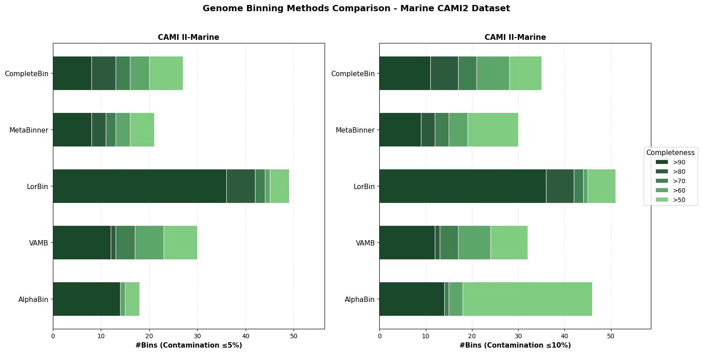

# MetaGLMBench
Benchmarking DNA Language Model on Metagenomics Tasks

## 📊 Datasets

### CAMI 2

CAMI - Critical Assessment of Metagenome Interpretation: https://cami-challenge.org/

> First to evluate on marine sample0 and sample1

Marine: https://cami-challenge.org/datasets/Marine/

Plant-associated: https://cami-challenge.org/datasets/Plant-associated/

Strain-madness: https://cami-challenge.org/datasets/Strain-madness/


> First try to test MVP on marine dataset

 ```
# unzip files
tar -zxvf *.tar.gz

# how to proporcess */bam files
samtools merge - *.bam | samtools sort -o merged_sorted.bam -
 ```

### Real Samples

Those can be assessed by the below Google Drive link

https://drive.google.com/drive/folders/15XQ-cBn8VlpW7jWRMqaNQiVrhNhmSXdo?usp=sharing

 ```
rclone copy XXX gdrive:/MetaGLMBench/REAL -P
 ```

## 🔧 Preprocess

> Real Samples provided by Google Drive link should be processed to get *sorted.bam files

 ```
# find . -mindepth 2 -name "*.fasta" -exec cat {} + > sample_0.fna

bowtie2-build sample_0.fna sample_0_index

bowtie2 -x sample_0_index \
        -1 Sample_0_illu_1.fq \
        -2 Sample_0_illu_2.fq \
        -S sample_0_unsorted.sam \
        --threads 50 \
        --very-sensitive

samtools view -bS sample_0_unsorted.sam | samtools sort -@ 10 -o sample_0.sorted.bam
 ```

## 📏 Binning Evaluation

> Genome binning can be seen as a clustering problem, where sequences are grouped into bins without taxon labels.

Real Samples can be tested by CheckM2 and CheckM.

CAMI 2 Samples can be tested by CheckM2, CheckM and AMBER.

### CheckM2

https://github.com/chklovski/CheckM2 

>  machine learning models to estimate completeness and contamination
 ```
# default is *.fna
checkm2 predict --threads 50 --input ./genome  --output-directory ./genome_checkm2_results

# add +x fasta if data format is *.fasta
checkm2 predict --threads 50 --input ./genome -x fasta --output-directory ./genome_checkm2_results
 ```

> Binning bench on cami 2 marine sample0 for deep learning binning methods


### CheckM

https://github.com/Ecogenomics/CheckM

> estimates genome completeness and contamination based on the presence or absence of marker genes, i.e., genes that are typically ubiquitous and single copy
 ```
checkm lineage_wf -t 8 -x fa /home/donovan/bins /home/donovan/checkm

checkm lineage_wf --genes -t 8 -x faa <bin folder> <output folder>
 ```

### AMBER

https://github.com/CAMI-challenge/AMBER

> Only CAMI Golden Standard Sample can be evaluated by AMBER

 ```
# *.fasta and *.fna are also accepted
python path/to/MetaGLMBench/convert_fasta_bins_to_biobox_format.py *.fa -o bins.tsv

python amber.py -g binning_gs.tsv \
bins.tsv \
-o output_dir/
 ```

## 📖 References

1. Fernando Meyer, Gary Robertson, Zhi-Luo Deng, David Koslicki, Alexey Gurevich, Alice C McHardy, CAMI Benchmarking Portal: online evaluation and ranking of metagenomic software, Nucleic Acids Research, Volume 53, Issue W1, 7 July 2025, Pages W102–W109, https://doi.org/10.1093/nar/gkaf369
2. Meyer, F., Fritz, A., Deng, ZL. et al. Critical Assessment of Metagenome Interpretation: the second round of challenges. Nat Methods 19, 429–440 (2022). DOI: 10.1038/s41592-022-01431-4
3. Sczyrba, A., Hofmann, P., Belmann, P. et al. Critical Assessment of Metagenome Interpretation—a benchmark of metagenomics software. Nat Methods 14, 1063–1071 (2017). DOI: 10.1038/nmeth.4458
4. Meyer, F., Lesker, TR., Koslicki, D. et al. Tutorial: assessing metagenomics software with the CAMI benchmarking toolkit. Nat Protoc 16, 1785–1801 (2021). DOI: 10.1038/s41596-020-00480-3
5. Mikheenko, A., Saveliev, V. & Gurevich, A. MetaQUAST: evaluation of metagenome assemblies. Bioinformatics 32, 1088–1090 (2016). DOI: 10.1093/bioinformatics/btv697
6. Meyer, F. et al. AMBER: assessment of metagenome BinnERs. Gigascience 7, giy069 (2018). DOI: 10.1093/gigascience/giy069
7. Meyer, F. et al. Assessing taxonomic metagenome profilers with OPAL. Genome Biol. 20, 51 (2019). DOI: 10.1186/s13059-019-1646-y


